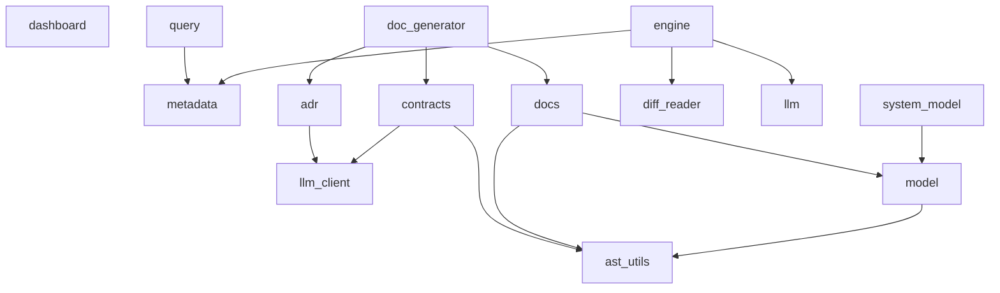

# Architecture

*Auto-generated from the incremental system model. Do not edit manually.*
*Last updated: 2026-04-15 17:52*

---

## Overview

gitmind maintains a commit-aware architecture model for the repository, then renders professional documentation and findings from that model. The system keeps fact extraction deterministic and uses generated prose only as a presentation layer.

## Data Flow

git commit -> hook -> engine -> diff reader -> semantic metadata -> incremental system model -> contracts/docs/findings -> dashboard

## Current Snapshot

- Modules tracked: 14
- Public API symbols: 28
- Dependency edges: 14
- Entry points: 4
- Findings: 10 risks, 1 strengths

---

## Component Diagram

---

## Components

### `cli/dashboard.py`

**Role:** `dashboard`

gitmind local dashboard — serves a web UI backed by metadata.json.

- Lines: 149
- Public API symbols: 5
- External imports: `argparse`, `http.server`, `json`, `os`, `pathlib`, `socketserver`

### `cli/query.py`

**Role:** `cli`

gitmind query CLI

- Lines: 91
- Public API symbols: 4
- Depends on: `core/metadata.py`
- External imports: `datetime`, `json`, `os`, `sys`

### `core/architecture/adr.py`

**Role:** `module`

ADR generation helpers for newly introduced features.

- Lines: 148
- Public API symbols: 1
- Depends on: `core/architecture/llm_client.py`
- Used by: `core/doc_generator.py`
- External imports: `datetime`, `os`, `re`, `typing`

### `core/architecture/ast_utils.py`

**Role:** `module`

AST-backed helpers used by documentation and architecture rendering.

- Lines: 93
- Public API symbols: 2
- Used by: `core/architecture/contracts.py`, `core/architecture/docs.py`, `core/architecture/model.py`
- External imports: `ast`, `os`

### `core/architecture/contracts.py`

**Role:** `module`

Incremental contract generation for changed source modules.

- Lines: 205
- Public API symbols: 1
- Depends on: `core/architecture/ast_utils.py`, `core/architecture/llm_client.py`
- Used by: `core/doc_generator.py`
- External imports: `datetime`, `json`, `os`, `re`, `typing`

### `core/architecture/docs.py`

**Role:** `documentation`

Markdown renderers for architecture snapshots and findings.

- Lines: 222
- Public API symbols: 2
- Depends on: `core/architecture/ast_utils.py`, `core/architecture/model.py`
- Used by: `core/doc_generator.py`
- External imports: `datetime`, `os`

### `core/architecture/llm_client.py`

**Role:** `integration`

Small Ollama client for architecture-oriented generation tasks.

- Lines: 37
- Public API symbols: 1
- Used by: `core/architecture/adr.py`, `core/architecture/contracts.py`
- External imports: `json`, `re`, `requests`

### `core/architecture/model.py`

**Role:** `architecture_model`

Incremental system model extraction plus rule-based architecture findings.

- Lines: 554
- Public API symbols: 3
- Depends on: `core/architecture/ast_utils.py`
- Used by: `core/architecture/docs.py`, `core/system_model.py`
- External imports: `ast`, `datetime`, `json`, `os`

### `core/diff_reader.py`

**Role:** `git_adapter`

- Lines: 83
- Public API symbols: 4
- Used by: `core/engine.py`
- External imports: `subprocess`

### `core/doc_generator.py`

**Role:** `compatibility`

Compatibility wrapper for architecture documentation generation.

- Lines: 12
- Public API symbols: 0
- Depends on: `core/architecture/adr.py`, `core/architecture/contracts.py`, `core/architecture/docs.py`

### `core/engine.py`

**Role:** `orchestrator`

- Lines: 86
- Public API symbols: 1
- Depends on: `core/diff_reader.py`, `core/llm.py`, `core/metadata.py`
- External imports: `architecture`, `os`, `sys`

### `core/llm.py`

**Role:** `integration`

- Lines: 142
- Public API symbols: 1
- Used by: `core/engine.py`
- External imports: `json`, `re`, `requests`

### `core/metadata.py`

**Role:** `storage`

- Lines: 58
- Public API symbols: 3
- Used by: `cli/query.py`, `core/engine.py`
- External imports: `datetime`, `json`, `os`

### `core/system_model.py`

**Role:** `compatibility`

Compatibility wrapper for the incremental architecture model.

- Lines: 5
- Public API symbols: 0
- Depends on: `core/architecture/model.py`

---

## Function Reference

_Extracted directly from the current architecture model._

### `cli/dashboard.py`

- `def find_metadata() -> Path`
  > Locate metadata.json by walking up to the git root.
- `def find_dashboard_data() -> Path`
- `def find_findings() -> Path`
- `def make_handler(metadata_path: Path, dashboard_path: Path, findings_path: Path, stale_days: int)`
- `def main()`

### `cli/query.py`

- `def cmd_features()`
- `def cmd_files(feature_name)`
- `def cmd_history()`
- `def cmd_stale(days)`

### `core/architecture/adr.py`

- `def generate_adr(summary: dict, commit_hash: str, commit_message: str, repo_root: str) -> Optional[str]`
  > Generate an ADR for a new-feature commit.

### `core/architecture/ast_utils.py`

- `def extract_signatures(filepath: str) -> list[dict]`
  > Extract public function and class signatures from a Python module.
- `def scan_source_files(repo_root: str) -> list[str]`
  > Return source .py files in tracked source directories.

### `core/architecture/contracts.py`

- `def update_contracts(changed_files: list[str], repo_root: str) -> Optional[str]`
  > Update docs/contracts.md for changed source files.

### `core/architecture/docs.py`

- `def generate_architecture_doc(repo_root: str) -> str`
  > Render docs/architecture.md from the persisted system model.
- `def generate_findings_doc(repo_root: str) -> str`
  > Render docs/quality-findings.md from the stored findings JSON.

### `core/architecture/llm_client.py`

- `def llm_json(prompt: str, timeout: int) -> dict`
  > Call Ollama and parse the first JSON object in the response.

### `core/architecture/model.py`

- `def load_system_model(repo_root: str) -> dict`
- `def load_findings(repo_root: str) -> dict`
- `def update_system_model(changed_files: list[str], repo_root: str, commit_hash: str) -> dict`

### `core/diff_reader.py`

- `def get_latest_diff() -> str`
- `def get_changed_files() -> list[str]`
- `def get_commit_message() -> str`
- `def get_commit_hash() -> str`

### `core/engine.py`

- `def run()`

### `core/llm.py`

- `def analyze_diff(diff: str, commit_message: str, changed_files: list) -> dict`

### `core/metadata.py`

- `def load() -> dict`
- `def save(data: dict)`
- `def update(summary: dict, commit_hash: str) -> dict`
