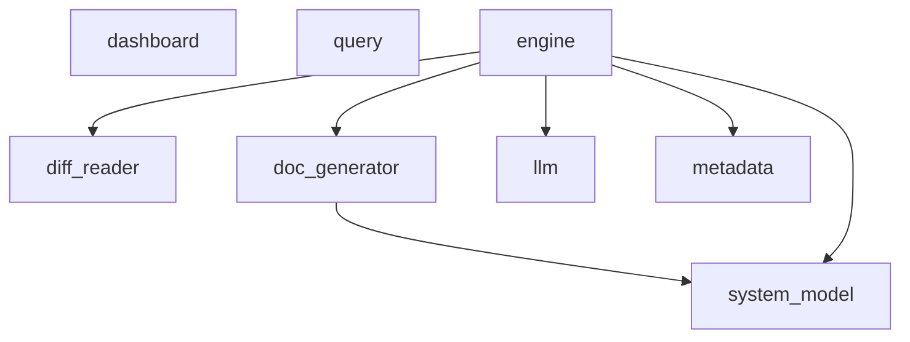

# Architecture

*Auto-generated from the incremental system model. Do not edit manually.*
*Last updated: 2026-04-15 17:25*

---

## Overview

gitmind maintains a commit-aware architecture model for the repository, then renders professional documentation and findings from that model. The system keeps fact extraction deterministic and uses generated prose only as a presentation layer.

## Data Flow

git commit -> hook -> engine -> diff reader -> semantic metadata -> incremental system model -> contracts/docs/findings -> dashboard

## Current Snapshot

- Modules tracked: 8
- Public API symbols: 25
- Dependency edges: 6
- Entry points: 4
- Findings: 10 risks, 1 strengths

---

## Component Diagram

---

## Components

### `cli/dashboard.py`

**Role:** `dashboard`

gitmind local dashboard — serves a web UI backed by metadata.json.

- Lines: 149
- Public API symbols: 5
- External imports: `argparse`, `http.server`, `json`, `os`, `pathlib`, `socketserver`

### `cli/query.py`

**Role:** `cli`

gitmind query CLI

- Lines: 91
- Public API symbols: 4

### `core/diff_reader.py`

**Role:** `git_adapter`

- Lines: 83
- Public API symbols: 4
- Used by: `core/engine.py`

### `core/doc_generator.py`

**Role:** `documentation`

Generates FAANG-style living documentation from the codebase + commit metadata.

- Lines: 786
- Public API symbols: 4
- Depends on: `core/system_model.py`
- Used by: `core/engine.py`
- External imports: `ast`, `datetime`, `json`, `os`, `re`, `requests`

### `core/engine.py`

**Role:** `orchestrator`

- Lines: 86
- Public API symbols: 1
- Depends on: `core/diff_reader.py`, `core/doc_generator.py`, `core/llm.py`, `core/metadata.py`, `core/system_model.py`
- External imports: `os`, `sys`

### `core/llm.py`

**Role:** `integration`

- Lines: 142
- Public API symbols: 1
- Used by: `core/engine.py`

### `core/metadata.py`

**Role:** `storage`

- Lines: 58
- Public API symbols: 3
- Used by: `core/engine.py`

### `core/system_model.py`

**Role:** `architecture_model`

- Lines: 545
- Public API symbols: 3
- Used by: `core/doc_generator.py`, `core/engine.py`
- External imports: `ast`, `datetime`, `json`, `os`

---

## Function Reference

_Extracted directly from the current architecture model._

### `cli/dashboard.py`

- `def find_metadata() -> Path`
  > Locate metadata.json by walking up to the git root.
- `def find_dashboard_data() -> Path`
- `def find_findings() -> Path`
- `def make_handler(metadata_path: Path, dashboard_path: Path, findings_path: Path, stale_days: int)`
- `def main()`

### `cli/query.py`

- `def cmd_features()`
- `def cmd_files(feature_name)`
- `def cmd_history()`
- `def cmd_stale(days)`

### `core/diff_reader.py`

- `def get_latest_diff() -> str`
- `def get_changed_files() -> list[str]`
- `def get_commit_message() -> str`
- `def get_commit_hash() -> str`

### `core/doc_generator.py`

- `def generate_architecture_doc(repo_root: str) -> str`
  > Rebuild docs/architecture.md from the persisted system model.
- `def generate_findings_doc(repo_root: str) -> str`
- `def update_contracts(changed_files: list[str], repo_root: str) -> Optional[str]`
  > Update docs/contracts.md with real contracts for changed source files.
- `def generate_adr(summary: dict, commit_hash: str, commit_message: str, repo_root: str) -> Optional[str]`
  > Generate an ADR for a new feature commit.

### `core/engine.py`

- `def run()`

### `core/llm.py`

- `def analyze_diff(diff: str, commit_message: str, changed_files: list) -> dict`

### `core/metadata.py`

- `def load() -> dict`
- `def save(data: dict)`
- `def update(summary: dict, commit_hash: str) -> dict`

### `core/system_model.py`

- `def load_system_model(repo_root: str) -> dict`
- `def load_findings(repo_root: str) -> dict`
- `def update_system_model(changed_files: list[str], repo_root: str, commit_hash: str) -> dict`
